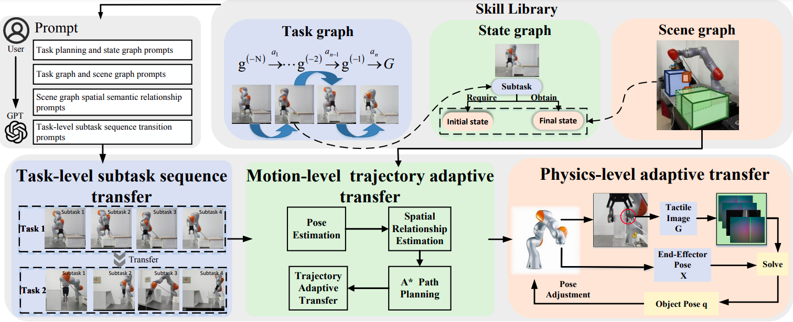
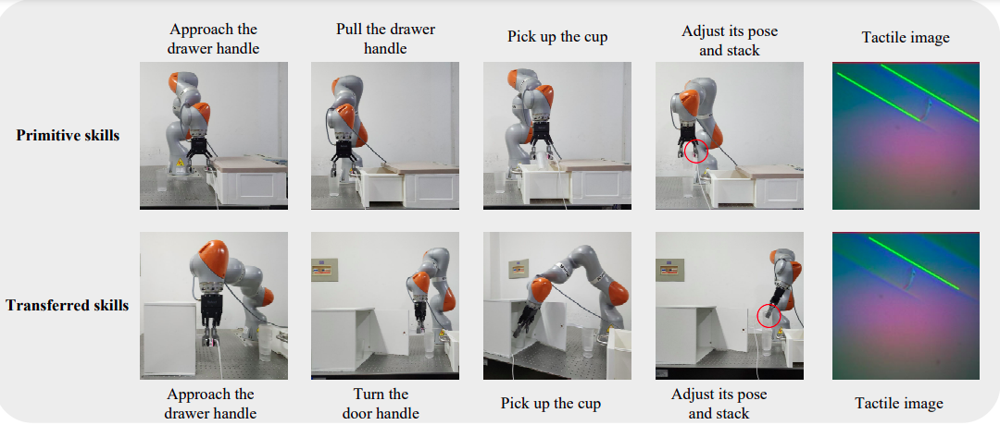

<h1 align="center">
Semantic-Geometric-Physical-Driven Robot Manipulation Skill Transfer
via Skill Library and Tactile Representation<br>
</h1>

Mingchao Qi, Yuanjin Li, Xing Liu<sup>* </sup>, Yizhai Zhang, Pangfeng Huang

**Paper Access:** [📝PDF](https://arxiv.org/pdf/2411.11714) | [arXiv](https://arxiv.org/abs/2411.11714)<br>
**Hardware Support:** Kuka iiwa14


# 📚 Overview




# 🛠️ Installation


# 🧑🏻‍💻 Usage 


## Deployment on Real-Robots


# 📦 


# 👍 Citation
If you find our work helpful, please cite us:

```
@article{qi2024semantic,
  title={Semantic-Geometric-Physical-Driven Robot Manipulation Skill Transfer via Skill Library and Tactile Representation},
  author={Qi, Mingchao and Li, Yuanjin and Liu, Xing and Liu, Zhengxiong and Huang, Panfeng},
  journal={arXiv preprint arXiv:2411.11714},
  year={2024}
}
```

# 🏷️ License
This repository is released under the MIT license. See [LICENSE](./LICENSE) for additional details.
